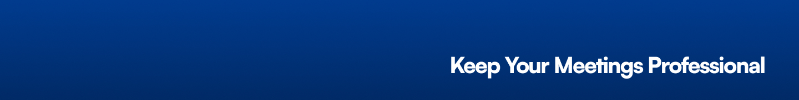

<p align="center"></p>

[](https://github.com/stacksjs/hush/actions/workflows/ci.yml)
[](https://github.com/stacksjs/hush/actions/workflows/release.yml)
<!-- [![npm downloads][npm-downloads-src]][npm-downloads-href] -->
<!-- [![Codecov][codecov-src]][codecov-href] -->

# Hush

> A modern macOS app that automatically detects when you're screen sharing and enables Do Not Disturb mode to protect your privacy.

## Features

- 🎯 **Advanced Screen Sharing Detection** - Multiple detection methods for reliable operation
- 🔕 **Automatic Do Not Disturb** - Toggles Focus modes automatically when screen sharing starts/stops
- 🔄 **Background Operation** - Runs quietly in your menu bar
- 🔔 **Smart Notifications** - Notifies you when protection is enabled/disabled
- ⚙️ **Customizable Settings** - Configure Focus modes, detection intervals, and more
- 📊 **Usage Statistics** - Track how often you share your screen and for how long
- 🚀 **Auto Launch** - Optional startup at login
- 🔒 **Privacy Focused** - Works locally on your Mac with no data collection

## Enhanced Detection Methods

Hush uses multiple methods to reliably detect screen sharing:
- macOS built-in screen sharing status
- Active application detection for common screen sharing apps (Zoom, Teams, etc.)
- Window monitoring for screen sharing indicators
- Screen capture state detection

## Requirements

- macOS 14.0 or later _(Sonoma and above)_
- Xcode 16.0 or later _(for development)_
- Swift 6.0

## Building

1. Open `Hush.xcodeproj` in Xcode 16 or later
2. Build and run the project

## Usage

1. Hush runs in your menu bar
2. When screen sharing is detected, Do Not Disturb mode is automatically enabled
3. When screen sharing ends, Do Not Disturb mode is automatically disabled
4. Click the menu bar icon to access settings, statistics, and more

## Privacy

Hush only detects screen sharing state locally on your Mac and doesn't collect or transmit any data.

## Testing

```bash
swift test
```

You can also run the Xcode tests using:

```bash
cd Hush
xcodebuild test -project Hush.xcodeproj -scheme Hush
```

## Changelog

Please see our [CHANGELOG.md](CHANGELOG.md) for more information on what has changed recently.

## Contributing

Please see the [Contributing Guide](.github/CONTRIBUTING.md) for details.

## Community

For help, discussion about best practices, or any other conversation that would benefit from being searchable:

[Discussions on GitHub](https://github.com/username/hush/discussions)

## Postcardware

"Software that is free, but hopes for a postcard." We love receiving postcards from around the world showing where Stacks is being used! We showcase them on our website too.

Our address: Stacks.js, 12665 Village Ln #2306, Playa Vista, CA 90094, United States 🌎

## Sponsors

We would like to extend our thanks to the following sponsors for funding Stacks development. If you are interested in becoming a sponsor, please reach out to us.

- [JetBrains](https://www.jetbrains.com/)
- [The Solana Foundation](https://solana.com/)

## Credits

- [Muzzle](https://github.com/gilbarbara/muzzle) - Thanks for the inspiration!
- [Chris Breuer](https://github.com/chrisbbreuer)
- [All Contributors](../../contributors)

## License

The MIT License (MIT). Please see [LICENSE](LICENSE.md) for more information.

Made with 💙
